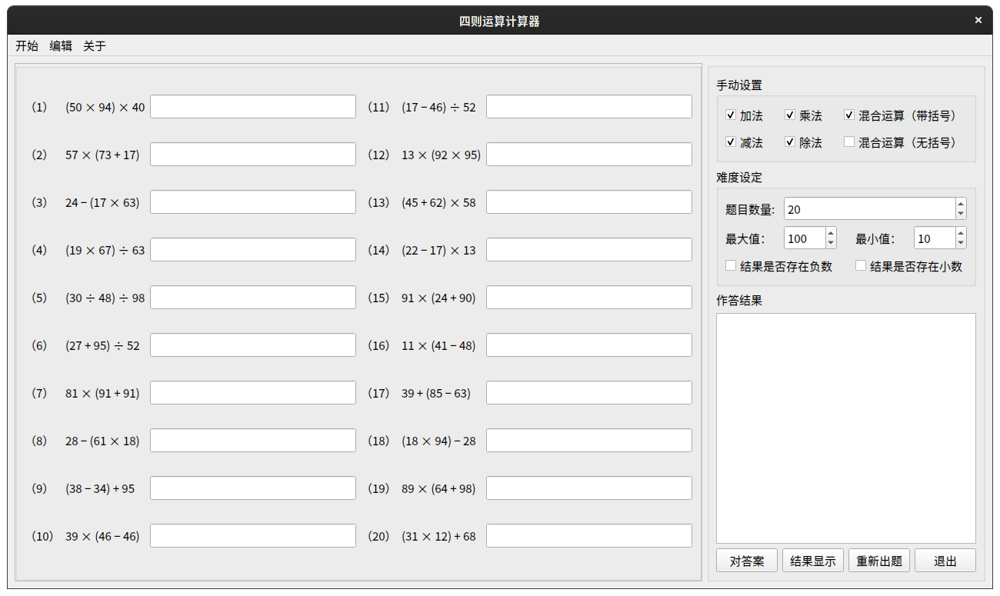

# Arithmetic Generator Qt



Four arithmetic generator written in C++ and based on Qt5.

[简体中文](README_CN.md)

# Usage

Install Qt and CMake, build utils on your computer.

```
$ git clone https://github.com/se-hwk-group/ArithemeticQt.git
$ cd ArithmeticQt
$ mkdir build && cd build
$ cmake .. && make -j4
$ ./Arithmetic
```

# License

> Apache 2.0
